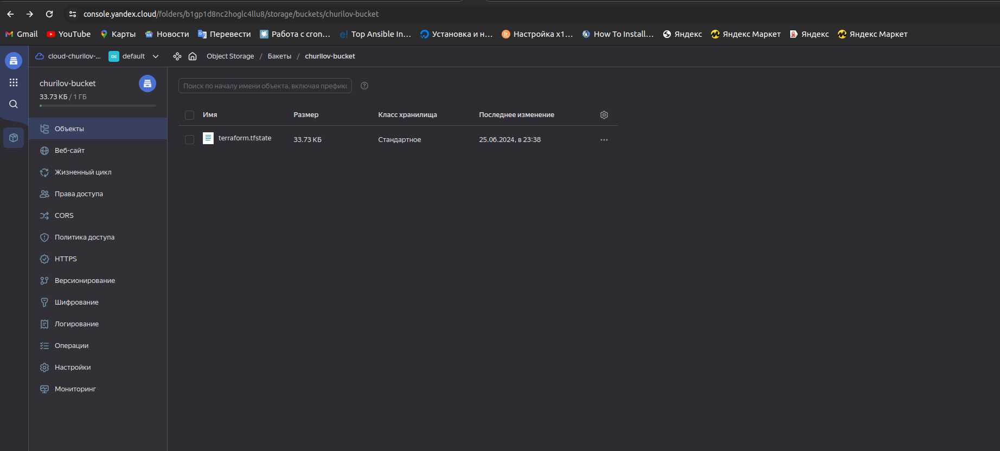
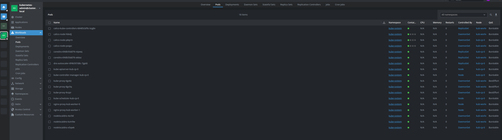

# Дипломный практикум в Yandex.Cloud
  * [Цели:](#цели)
  * [Этапы выполнения:](#этапы-выполнения)
     * [Создание облачной инфраструктуры](#создание-облачной-инфраструктуры)
     * [Создание Kubernetes кластера](#создание-kubernetes-кластера)
     * [Создание тестового приложения](#создание-тестового-приложения)
     * [Подготовка cистемы мониторинга и деплой приложения](#подготовка-cистемы-мониторинга-и-деплой-приложения)
     * [Установка и настройка CI/CD](#установка-и-настройка-cicd)
  * [Что необходимо для сдачи задания?](#что-необходимо-для-сдачи-задания)
  * [Как правильно задавать вопросы дипломному руководителю?](#как-правильно-задавать-вопросы-дипломному-руководителю)

**Перед началом работы над дипломным заданием изучите [Инструкция по экономии облачных ресурсов](https://github.com/netology-code/devops-materials/blob/master/cloudwork.MD).**

---
## Цели:

1. Подготовить облачную инфраструктуру на базе облачного провайдера Яндекс.Облако.
2. Запустить и сконфигурировать Kubernetes кластер.
3. Установить и настроить систему мониторинга.
4. Настроить и автоматизировать сборку тестового приложения с использованием Docker-контейнеров.
5. Настроить CI для автоматической сборки и тестирования.
6. Настроить CD для автоматического развёртывания приложения.

---
## Этапы выполнения:


### Создание облачной инфраструктуры

Для начала необходимо подготовить облачную инфраструктуру в ЯО при помощи [Terraform](https://www.terraform.io/).

Особенности выполнения:

- Бюджет купона ограничен, что следует иметь в виду при проектировании инфраструктуры и использовании ресурсов;
Для облачного k8s используйте региональный мастер(неотказоустойчивый). Для self-hosted k8s минимизируйте ресурсы ВМ и долю ЦПУ. В обоих вариантах используйте прерываемые ВМ для worker nodes.

Предварительная подготовка к установке и запуску Kubernetes кластера.

1. Создайте сервисный аккаунт, который будет в дальнейшем использоваться Terraform для работы с инфраструктурой с необходимыми и достаточными правами. Не стоит использовать права суперпользователя
2. Подготовьте [backend](https://www.terraform.io/docs/language/settings/backends/index.html) для Terraform:  
   а. Рекомендуемый вариант: S3 bucket в созданном ЯО аккаунте(создание бакета через TF)
   б. Альтернативный вариант:  [Terraform Cloud](https://app.terraform.io/)  
3. Создайте VPC с подсетями в разных зонах доступности.
4. Убедитесь, что теперь вы можете выполнить команды `terraform destroy` и `terraform apply` без дополнительных ручных действий.
5. В случае использования [Terraform Cloud](https://app.terraform.io/) в качестве [backend](https://www.terraform.io/docs/language/settings/backends/index.html) убедитесь, что применение изменений успешно проходит, используя web-интерфейс Terraform cloud.

Ожидаемые результаты:

1. Terraform сконфигурирован и создание инфраструктуры посредством Terraform возможно без дополнительных ручных действий.
2. Полученная конфигурация инфраструктуры является предварительной, поэтому в ходе дальнейшего выполнения задания возможны изменения.

###Ответ:
В качестве Backend использовал S3:

Команды terraform выполняются - доказано в след пункте.


---
### Создание Kubernetes кластера

На этом этапе необходимо создать [Kubernetes](https://kubernetes.io/ru/docs/concepts/overview/what-is-kubernetes/) кластер на базе предварительно созданной инфраструктуры.   Требуется обеспечить доступ к ресурсам из Интернета.

Это можно сделать двумя способами:

1. Рекомендуемый вариант: самостоятельная установка Kubernetes кластера.  
   а. При помощи Terraform подготовить как минимум 3 виртуальных машины Compute Cloud для создания Kubernetes-кластера. Тип виртуальной машины следует выбрать самостоятельно с учётом требовании к производительности и стоимости. Если в дальнейшем поймете, что необходимо сменить тип инстанса, используйте Terraform для внесения изменений.  
   б. Подготовить [ansible](https://www.ansible.com/) конфигурации, можно воспользоваться, например [Kubespray](https://kubernetes.io/docs/setup/production-environment/tools/kubespray/)  
   в. Задеплоить Kubernetes на подготовленные ранее инстансы, в случае нехватки каких-либо ресурсов вы всегда можете создать их при помощи Terraform.
2. Альтернативный вариант: воспользуйтесь сервисом [Yandex Managed Service for Kubernetes](https://cloud.yandex.ru/services/managed-kubernetes)  
  а. С помощью terraform resource для [kubernetes](https://registry.terraform.io/providers/yandex-cloud/yandex/latest/docs/resources/kubernetes_cluster) создать **региональный** мастер kubernetes с размещением нод в разных 3 подсетях      
  б. С помощью terraform resource для [kubernetes node group](https://registry.terraform.io/providers/yandex-cloud/yandex/latest/docs/resources/kubernetes_node_group)
  
Ожидаемый результат:

1. Работоспособный Kubernetes кластер.
2. В файле `~/.kube/config` находятся данные для доступа к кластеру.
3. Команда `kubectl get pods --all-namespaces` отрабатывает без ошибок.

###Ответ:
С помощью terraform, kubespray и своего ansible для gitlab развернул структуру из 4-ех ВМ:
контрол ноды, 
2-ух воркеров,
машины с gitlab

```
null_resource.kubernetes (local-exec): PLAY RECAP *********************************************************************
null_resource.kubernetes (local-exec): kub-cp-0                   : ok=587  changed=137  unreachable=0    failed=0    skipped=1018 rescued=0    ignored=6   
null_resource.kubernetes (local-exec): kub-worker-0               : ok=459  changed=90   unreachable=0    failed=0    skipped=766  rescued=0    ignored=1   
null_resource.kubernetes (local-exec): kub-worker-1               : ok=415  changed=87   unreachable=0    failed=0    skipped=668  rescued=0    ignored=1   

null_resource.kubernetes: Creation complete after 26m46s [id=2881326489399691366]

Apply complete! Resources: 16 added, 0 changed, 0 destroyed.

Outputs:

cp_nodes = [
  "name=kub-cp-0, public=51.250.88.134, private=10.128.0.24",
]
gitlab = [
  "name=gitlab, public=51.250.1.133, private=10.128.0.11",
]
worker_nodes = [
  "name=kub-worker-0, public=51.250.8.85, private=10.128.0.10",
  "name=kub-worker-1, public=51.250.16.80, private=10.129.0.10",
]
ret@ret-vm:~/diplom/terraform$ 
```
Подключаемся к контрол ноде и забираем конфиг (заменив в нем ip на внешний ip контрол ноды):

```
ret@ret-vm:~/diplom/terraform$ ssh ubuntu@51.250.88.134
Welcome to Ubuntu 22.04.4 LTS (GNU/Linux 5.15.0-107-generic x86_64)

 * Documentation:  https://help.ubuntu.com
 * Management:     https://landscape.canonical.com
 * Support:        https://ubuntu.com/pro

 System information as of Tue Jun 25 09:09:10 PM UTC 2024

  System load:  0.15               Processes:             168
  Usage of /:   35.5% of 19.59GB   Users logged in:       0
  Memory usage: 44%                IPv4 address for eth0: 10.128.0.24
  Swap usage:   0%

 * Strictly confined Kubernetes makes edge and IoT secure. Learn how MicroK8s
   just raised the bar for easy, resilient and secure K8s cluster deployment.

   https://ubuntu.com/engage/secure-kubernetes-at-the-edge

Expanded Security Maintenance for Applications is not enabled.

13 updates can be applied immediately.
To see these additional updates run: apt list --upgradable

Enable ESM Apps to receive additional future security updates.
See https://ubuntu.com/esm or run: sudo pro status


*** System restart required ***
Last login: Tue Jun 25 20:57:58 2024 from 89.113.153.154
ubuntu@kub-cp-0:~$ sudo cat /root/.kube/config
apiVersion: v1
clusters:
- cluster:
    certificate-authority-data: LS0tLS1CRUdJTiBDRVJUSUZJQ0FURS0tLS0tCk1JSURCVENDQWUyZ0F3SUJBZ0lJSGhqNkljUW1UbHN3RFFZSktvWklodmNOQVFFTEJRQXdGVEVUTUJFR0ExVUUKQXhNS2EzVmlaWEp1WlhSbGN6QWVGdzB5TkRBMk1qVXlNRFEwTlRaYUZ3MHpOREEyTWpNeU1EUTVOVFphTUJVeApFekFSQmdOVkJBTVRDbXQxWW1WeWJtVjBaWE13Z2dFaU1BMEdDU3FHU0liM0RRRUJBUVVBQTRJQkR3QXdnZ0VLCkFvSUJBUUN5bGJLbzBoaGdKMXY0R1dZRlgxckFVV1Q3M1cyN2dvN1U3QzlKZ3VqV0VDUmU2eDNwV25qdzZXWi8KRkJRSExBSW1iblZicGgySDNKbzRDTFVwZyt6c1JIN1J3cmt4R2NYSm1EcnkwcXpvZnExek1YQW1mbzloZWdJbwpHRDV1MVRCdUQ0dTN0MG1pbkExVll6YXp5Um00ejdxb05ERnZzVWFFV0ErVFRsMXNZVkpmZExtSkNNb3JyNit5Ck9nNjF5VlFKMzNyeGYybEVyL0ptalRaeDcwcHhMMXExZWp0RFJFZ0tKaStDK2FsL0tFVU90U1gxbnRpeGFBSHMKMm5SakV1eXlzZmhiZlk4UGN5bXZ2UllOV0tCZmRjYmZoNUNaV0lUVUZWNEJBNGNiSjk2VitpK2ZXT0gwMzg0RgpoNEd0aVlQNVNGRW5lY1NYTUlsSk9hTUJQSUdGQWdNQkFBR2pXVEJYTUE0R0ExVWREd0VCL3dRRUF3SUNwREFQCkJnTlZIUk1CQWY4RUJUQURBUUgvTUIwR0ExVWREZ1FXQkJSbytlQ2ZDWWY4bkpDam9STGx0anlIY1JLM3pqQVYKQmdOVkhSRUVEakFNZ2dwcmRXSmxjbTVsZEdWek1BMEdDU3FHU0liM0RRRUJDd1VBQTRJQkFRQU9oem1FcytBZAozUlQ4aWdGRHV4L0tQdmJVU1ltbC9HZzI1K1F5QVFKeWszTGxXZkJDSFZnR0xqUytJa1A0M1FselRqSEUwSVlrCjRyYThjV3g2U2o3cFBOb09PaSt1VFF4Q1RIZWxOanNRdHdaazQzWEJEOTVQbHVrNmF4d3VrK1ZyYkl2bnZYMHYKLytSMnJVODNmMHgxN2lLazMxQ0Q1NkxCSWRjZHlFZGw1M0puL1NLMWVyNnZQOGNtR1ptdFJDZi9xOXdmZWZJbAorUHR4RFBYODVTTWtCRzBNa21UemdsTmQ1TlU5YUlVaXlxamJuQ0pVSGpIUjdOeG96b0hnUTBpWFJ1MHNSZEdBClR5di8ydXpvWnpoWHhTVXNzcXI3RWRTaWNPWWt2S3pzRit6bEE1c2lSTmtnQndYT09pTmw0WnRINmFTejJldU4KaDBhMWZhcmpqWEdPCi0tLS0tRU5EIENFUlRJRklDQVRFLS0tLS0K
    server: https://127.0.0.1:6443
  name: cluster.local
contexts:
- context:
    cluster: cluster.local
    user: kubernetes-admin
  name: kubernetes-admin@cluster.local
current-context: kubernetes-admin@cluster.local
kind: Config
preferences: {}
users:
- name: kubernetes-admin
  user:
    client-certificate-data: LS0tLS1CRUdJTiBDRVJUSUZJQ0FURS0tLS0tCk1JSURLVENDQWhHZ0F3SUJBZ0lJR1h4U09uZi9jUEl3RFFZSktvWklodmNOQVFFTEJRQXdGVEVUTUJFR0ExVUUKQXhNS2EzVmlaWEp1WlhSbGN6QWVGdzB5TkRBMk1qVXlNRFEwTlRaYUZ3MHlOVEEyTWpVeU1EUTVOVGhhTUR3eApIekFkQmdOVkJBb1RGbXQxWW1WaFpHMDZZMngxYzNSbGNpMWhaRzFwYm5NeEdUQVhCZ05WQkFNVEVHdDFZbVZ5CmJtVjBaWE10WVdSdGFXNHdnZ0VpTUEwR0NTcUdTSWIzRFFFQkFRVUFBNElCRHdBd2dnRUtBb0lCQVFEc1ZOMXYKTDB2eHZSUWVtZy9HUTFSUTUwWjEzaWFzWG91UXUvd1hnN3pBUFBPeUppMlI2KzRWN3RNOUZCaXp4OXo1T2NxKwo3VlZyOGMvQ2tNQWdiQjIxUTUxRjhLVHZLK0lmbk1hdVhGd0FGaDh0YU5PUCtiRTVlRGlCUEg5STllVnZBWm1BClVJU3d3REwrQzd0aTNYVDF1T1VxaER4Q1N0V1cvU1llcGd4TGhaenZURU1tZVNWK1Q0NG91TkN6RHdJaFlkSjcKK2cwcThzMTUwNGluMkZnRDZEOHJML09OSktRK2RIdEdvUVlyZnc2M1BhTzZhMXpMSzR0cHJ0ZmZRK1BtckYvbAp0Q2QydUhpSVNZRGk4ZU9kSFZ4dFhXamhYR3VGdTJLSkk4K0h2T0lGQ2I5c3kwMjB1WjhQUVltSWJ1RGRNRlBYCklVdzd0RG1yREhsakJKeXJBZ01CQUFHalZqQlVNQTRHQTFVZER3RUIvd1FFQXdJRm9EQVRCZ05WSFNVRUREQUsKQmdnckJnRUZCUWNEQWpBTUJnTlZIUk1CQWY4RUFqQUFNQjhHQTFVZEl3UVlNQmFBRkdqNTRKOEpoL3lja0tPaApFdVcyUElkeEVyZk9NQTBHQ1NxR1NJYjNEUUVCQ3dVQUE0SUJBUUNiVFVaaWJ5N082STZxNkJFTmtjY09hMUVuCmpHZll6RGgyRTNmM3pPanp5MStSbjVQWElmeWFzeWl4U3BhaU1zelBEYWRjU1UrQStDdHRnM09QVUNUYS8xQ0YKWEl6cXA5VFZ0L3hBTnhRYUJOaU9OVmVoTlAzcksxVHNnUk1IK3VZYlFMZUUvR2J5WDA4VkV4OGZLUy80d2V3OAplclpTZGpJYzU3N0NLemxHQWt6eVVNb2RkYkR4ZXJ3RXRjR3dHN25aRVltVnlwUVU3VlFPS1d2dS8raXlybEhwClgwSjhBOWMvdEIrNVZYSjkydjVmVU5DcE5jTEFCbjJ4OHRKZUl5a1BSdmpDeFpvOXpsTnA4UTkxZ1RnZjQ3SUkKOUlHTHE0VVFBeWJvalk3UlIwV1NyOTU0OUFWR2NZbG1scjlQK01hcENGNmp1bnl0SEpVbWNnRElzSUU3Ci0tLS0tRU5EIENFUlRJRklDQVRFLS0tLS0K
    client-key-data: LS0tLS1CRUdJTiBSU0EgUFJJVkFURSBLRVktLS0tLQpNSUlFcFFJQkFBS0NBUUVBN0ZUZGJ5OUw4YjBVSHBvUHhrTlVVT2RHZGQ0bXJGNkxrTHY4RjRPOHdEenpzaVl0CmtldnVGZTdUUFJRWXM4ZmMrVG5LdnUxVmEvSFB3cERBSUd3ZHRVT2RSZkNrN3l2aUg1ekdybHhjQUJZZkxXalQKai9teE9YZzRnVHgvU1BYbGJ3R1pnRkNFc01BeS9ndTdZdDEwOWJqbEtvUThRa3JWbHYwbUhxWU1TNFdjNzB4RApKbmtsZmsrT0tMalFzdzhDSVdIU2Uvb05LdkxOZWRPSXA5aFlBK2cvS3kvempTU2tQblI3UnFFR0szOE90ejJqCnVtdGN5eXVMYWE3WDMwUGo1cXhmNWJRbmRyaDRpRW1BNHZIam5SMWNiVjFvNFZ4cmhidGlpU1BQaDd6aUJRbS8KYk10TnRMbWZEMEdKaUc3ZzNUQlQxeUZNTzdRNXF3eDVZd1NjcXdJREFRQUJBb0lCQVFDdVVWcVRyRHRFTDhjcgpXMC9QV2RKVGFvUGFaT1g1dGpNVHF0VWpNeFNDWjNNSk1JZmtYalhiRDdIWUYzNncvUGJORGdleUZMVXhUY2VGCkorZlBBbkJYUjJ3MkxtNDV6QkNhYUxWVDN1UXRYQ1BiQnJzbU0zSzVoU2VJaStzSEVma05qQXlCVE9MU3pMSFEKR1M4Nm1VYXdDSlZnYXZGWHBJTXZQOEppVVBBNHN3WXBUY28yejliTlAzQ1krU2FSZVFYaEhxVXpyY1FpWE9IRgo1Q3o2eDhzbmhmQ2M1Wm1lM1lUMExxa2FudWRHWnh2bVIrL3N5S1VRZGp5UnpCRXc3dUtJMXJaV1ZIb1ZRWTlXCjNsYzJRelREb1A5UzFlNXA0T2RpZWJ1Q1RpeTIrWFRvWkZqZVZyWlJEOEJpWDFHN0hGZFdJQmJBZnNZRjFub3YKZWNONlVubGhBb0dCQVAzTEpVTkpwOGhESDV3S3EvcGtFOEM0bGNyVm9WK2d0VDRDUVpIUkZ4SHlPN05EbW5zSgo1Zk4xWGk0L2tPWnZoUkFBQnZkWTFjTkZGYmx5c0VFdy8rY1BLdW0rRmJWWGd0QjRFRlZQZlNnckI3aEJjL1lTClY4b2RucTFRbjRUR1dXYkxhS3pOWGdoem9nOWptOUtyUm9zcDliWVQxeGQwMGJjbzg0aURkcUtQQW9HQkFPNWkKMnVsaVNHZmNCU1ZRc0t2TkM1eklYNG01V20vbFhaYTlTNVFBMGlXRGtodnFMWDFuVHdZYVRrMThvVk5KbUdtZQp6N0NTV0dRekY4TjVxN21WNGhvKzVReHNhRWNuTFNpcU1ocnNPT3B2cytMUHR6SHlTcmdqdjIxb3cyeGpiZUlKCit6amRsTEJyOUwvWjZjYVJxNmgrRlVsakFQWlRTUE80OW1BVnhnSWxBb0dCQUtJRXcvOFcwR1BLWmkySnFveW8Kd3V0dmEwRVg3SE5OOXlaazdsTVdkbkhnZ0RoSzJoM2VEY3pFaXFGZnR6TkUwbCtLaE9mMjhGQStsRVhWYjZ2TwppaStKd1UyREtmeWdwMFJLd2JLVWtrUElaSjgrT2JkSHNuKzNOUXRUd3VKU2RkUm4ycVVtWGZkclNuUWtsTitDCnRBQTNnMEwvbTNxLyt2bkF6T2ZEZFVNRkFvR0JBTlBsL1c4OUZOMTFQd0czWXdPanhURzlEdWR1WWt4YWxzRmEKVEdjbi82U20rbVpqMThIRDVnT251SGk2VXZDazE1enpOT3hnZWIrL2h0MFVOeWhGYWZFb2ZSTjQvWXhaNzVOWgpEaWJPV1oxU1k1VTJURUpTZkVhSVNDMnAxU1J3a1lrK2xCZ3RKbkZYMVB3QWFRUkFFbFU0bGhWZ3NzZENxdk15Ck01YWZaQjRkQW9HQUNqeUVXSkFvZDdtRTlZWERhRDdKUlI4aDhuT0JoRE44YTVuL3JkNmZrWkdQanNnQSttMSsKMFRRTUYrQUhqWjFUVnVLbDA2MlY4a3N5QXRiM2E5aDRGUGlMN1dDOU5paXpUVFA1YlhTM2tVanVwVDE5M2xMNgpVWDBmbjN1czEzNVFGeEQxMDd0YXhla2xkNk1qNEJpb0hsblBZQ2hpRmZoNng5Wk9ScU9CdmFvPQotLS0tLUVORCBSU0EgUFJJVkFURSBLRVktLS0tLQo=
ubuntu@kub-cp-0:~$ 
```
Меняем  
server: https://127.0.0.1:6443
на
server: https://51.250.88.134:6443
и копируем содержимое на локальную машину.

После этого выполняем на локальной машине
```
ret@ret-vm:~/diplom/terraform$ kubectl get nodes
NAME           STATUS   ROLES           AGE   VERSION
kub-cp-0       Ready    control-plane   24m   v1.29.5
kub-worker-0   Ready    <none>          22m   v1.29.5
kub-worker-1   Ready    <none>          22m   v1.29.5
ret@ret-vm:~/diplom/terraform$ kubectl get pods --all-namespaces
NAMESPACE     NAME                                       READY   STATUS    RESTARTS   AGE
kube-system   calico-kube-controllers-68485cbf9c-kzg8v   1/1     Running   0          19m
kube-system   calico-node-hbkdj                          1/1     Running   0          21m
kube-system   calico-node-p8qrm                          1/1     Running   0          21m
kube-system   calico-node-pxqpc                          1/1     Running   0          21m
kube-system   coredns-69db55dd76-ntpwq                   1/1     Running   0          18m
kube-system   coredns-69db55dd76-xk6xz                   1/1     Running   0          18m
kube-system   dns-autoscaler-6f4b597d8c-7gpt6            1/1     Running   0          18m
kube-system   kube-apiserver-kub-cp-0                    1/1     Running   1          24m
kube-system   kube-controller-manager-kub-cp-0           1/1     Running   2          24m
kube-system   kube-proxy-6gv6z                           1/1     Running   0          22m
kube-system   kube-proxy-8gv5q                           1/1     Running   0          22m
kube-system   kube-proxy-9cqsr                           1/1     Running   0          22m
kube-system   kube-scheduler-kub-cp-0                    1/1     Running   1          24m
kube-system   nginx-proxy-kub-worker-0                   1/1     Running   0          22m
kube-system   nginx-proxy-kub-worker-1                   1/1     Running   0          22m
kube-system   nodelocaldns-4zc9d                         1/1     Running   0          18m
kube-system   nodelocaldns-kzm9w                         1/1     Running   0          18m
kube-system   nodelocaldns-x5qwk                         1/1     Running   0          18m
ret@ret-vm:~/diplom/terraform$ 
```
LENS также нормально все отображает:

---
### Создание тестового приложения

Для перехода к следующему этапу необходимо подготовить тестовое приложение, эмулирующее основное приложение разрабатываемое вашей компанией.

Способ подготовки:

1. Рекомендуемый вариант:  
   а. Создайте отдельный git репозиторий с простым nginx конфигом, который будет отдавать статические данные.  
   б. Подготовьте Dockerfile для создания образа приложения.  
2. Альтернативный вариант:  
   а. Используйте любой другой код, главное, чтобы был самостоятельно создан Dockerfile.

Ожидаемый результат:

1. Git репозиторий с тестовым приложением и Dockerfile.
2. Регистри с собранным docker image. В качестве регистри может быть DockerHub или [Yandex Container Registry](https://cloud.yandex.ru/services/container-registry), созданный также с помощью terraform.

---
### Подготовка cистемы мониторинга и деплой приложения

Уже должны быть готовы конфигурации для автоматического создания облачной инфраструктуры и поднятия Kubernetes кластера.  
Теперь необходимо подготовить конфигурационные файлы для настройки нашего Kubernetes кластера.

Цель:
1. Задеплоить в кластер [prometheus](https://prometheus.io/), [grafana](https://grafana.com/), [alertmanager](https://github.com/prometheus/alertmanager), [экспортер](https://github.com/prometheus/node_exporter) основных метрик Kubernetes.
2. Задеплоить тестовое приложение, например, [nginx](https://www.nginx.com/) сервер отдающий статическую страницу.

Способ выполнения:
1. Воспользоваться пакетом [kube-prometheus](https://github.com/prometheus-operator/kube-prometheus), который уже включает в себя [Kubernetes оператор](https://operatorhub.io/) для [grafana](https://grafana.com/), [prometheus](https://prometheus.io/), [alertmanager](https://github.com/prometheus/alertmanager) и [node_exporter](https://github.com/prometheus/node_exporter). Альтернативный вариант - использовать набор helm чартов от [bitnami](https://github.com/bitnami/charts/tree/main/bitnami).

2. Если на первом этапе вы не воспользовались [Terraform Cloud](https://app.terraform.io/), то задеплойте и настройте в кластере [atlantis](https://www.runatlantis.io/) для отслеживания изменений инфраструктуры. Альтернативный вариант 3 задания: вместо Terraform Cloud или atlantis настройте на автоматический запуск и применение конфигурации terraform из вашего git-репозитория в выбранной вами CI-CD системе при любом комите в main ветку. Предоставьте скриншоты работы пайплайна из CI/CD системы.

Ожидаемый результат:
1. Git репозиторий с конфигурационными файлами для настройки Kubernetes.
2. Http доступ к web интерфейсу grafana.
3. Дашборды в grafana отображающие состояние Kubernetes кластера.
4. Http доступ к тестовому приложению.

---
### Установка и настройка CI/CD

Осталось настроить ci/cd систему для автоматической сборки docker image и деплоя приложения при изменении кода.

Цель:

1. Автоматическая сборка docker образа при коммите в репозиторий с тестовым приложением.
2. Автоматический деплой нового docker образа.

Можно использовать [teamcity](https://www.jetbrains.com/ru-ru/teamcity/), [jenkins](https://www.jenkins.io/), [GitLab CI](https://about.gitlab.com/stages-devops-lifecycle/continuous-integration/) или GitHub Actions.

Ожидаемый результат:
у
1. Интерфейс ci/cd сервиса доступен по http.
2. При любом коммите в репозиторие с тестовым приложением происходит сборка и отправка в регистр Docker образа.
3. При создании тега (например, v1.0.0) происходит сборка и отправка с соответствующим label в регистри, а также деплой соответствующего Docker образа в кластер Kubernetes.

---
## Что необходимо для сдачи задания?

1. Репозиторий с конфигурационными файлами Terraform и готовность продемонстрировать создание всех ресурсов с нуля.
2. Пример pull request с комментариями созданными atlantis'ом или снимки экрана из Terraform Cloud или вашего CI-CD-terraform pipeline.
3. Репозиторий с конфигурацией ansible, если был выбран способ создания Kubernetes кластера при помощи ansible.
4. Репозиторий с Dockerfile тестового приложения и ссылка на собранный docker image.
5. Репозиторий с конфигурацией Kubernetes кластера.
6. Ссылка на тестовое приложение и веб интерфейс Grafana с данными доступа.
7. Все репозитории рекомендуется хранить на одном ресурсе (github, gitlab)

